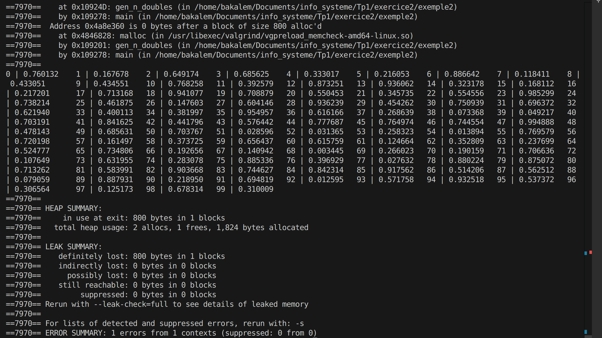
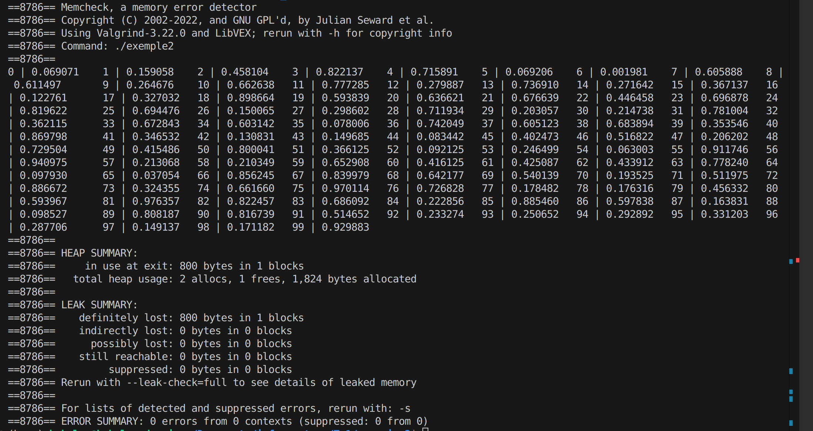

> To be noted that the compiler is clang. Have observed that the warnings or the compilation or the failure are different depending on the computer.

---

# Question 1

We observe the following warning:

```bash
exemple.c:9:17: warning: format specifies type 'int *' but the argument has type 'int' [-Wformat]
    9 |     scanf("%d", n_max);
      |            ~~   ^~~~~
1 warning generated.
```

# Question 2

We modify the Makefile in order to debug. We add the options -g -O0 and we re-make so that we can launch the debuger on th eterminal: `lldb ./exemple`

> Please note that on my computer GDB is not available since it requires the x86_64 architecture. lldb is available instead but they completly similar

Here is the result once we start the execution of the program:

```bash
(lldb) run
Process 42510 launched: '/Users/vasilisskarleas/Library/Mobile Documents/com~apple~CloudDocs/Documents/University Sorbonne/4th year/S7/Computer systems/TP1/exercise2/exemple' (arm64)
calcule la somme des n premiers entiers, entrez n : 3
Process 42510 stopped
* thread #1, queue = 'com.apple.main-thread', stop reason = EXC_BAD_ACCESS (code=1, address=0x1)
    frame #0: 0x000000019a44dd74 libsystem_c.dylib`__svfscanf_l + 5576
libsystem_c.dylib`__svfscanf_l:
->  0x19a44dd74 <+5576>: str    w24, [x25]
    0x19a44dd78 <+5580>: b      0x19a44e14c    ; <+6560>
    0x19a44dd7c <+5584>: adrp   x8, 403384
    0x19a44dd80 <+5588>: add    x8, x8, #0xb28 ; libc_hooks
Target 0: (exemple) stopped.
```

We can see clearly that it is all about a BAD_ACESS, meaning that we are trying to access on a place in the memory where we shouldn't and simply the operating system stops the process with ID 42510.

Here is what the pile of the functions call looks like:

```bash
(lldb) bt 1
* thread #1, queue = 'com.apple.main-thread', stop reason = EXC_BAD_ACCESS (code=1, address=0x1)
    frame #0: 0x000000019a44dd74 libsystem_c.dylib`__svfscanf_l + 5576
(lldb) bt 2
* thread #1, queue = 'com.apple.main-thread', stop reason = EXC_BAD_ACCESS (code=1, address=0x1)
  * frame #0: 0x000000019a44dd74 libsystem_c.dylib`__svfscanf_l + 5576
    frame #1: 0x000000019a4a3290 libsystem_c.dylib`scanf + 96
(lldb) bt
* thread #1, queue = 'com.apple.main-thread', stop reason = EXC_BAD_ACCESS (code=1, address=0x1)
  * frame #0: 0x000000019a44dd74 libsystem_c.dylib`__svfscanf_l + 5576
    frame #1: 0x000000019a4a3290 libsystem_c.dylib`scanf + 96
    frame #2: 0x0000000100003ea8 exemple`somme_n + 52
    frame #3: 0x0000000100003f34 exemple`main + 28
    frame #4: 0x000000019a22c274 dyld`start + 2840
```

We already know that program violates the access to the memory but what else we can see. Well, the error occurs inside the `scanf` function, which is often related to incorrect use of pointers, uninitialized variables, or improper format specifiers.  The crash originates in a function called `somme_n` from the `exemple` executable, where `scanf` is being called.

This error, escalates up to the `main function` because `somme_n` leads to main function, that is correct if get a look to the code.

Now we can take a look to the code and we see that the scanf() functionw as trying to save to the addresse n_max (probably reserved from the system) instead of the addresse of the variable n_max. Here is the proposed fix:

```c
scanf("%d", &n_max); // line 9
```

# Question 3

We compile the programe exemple2.c without any problem. It is supposed to generate 100 doubles (aleartoires between 0 and 1). Well, we can say that probably it does this, however, it do not stop, so we can't verify if it works as expected and personally I believe that this is not the general purpose of the program (being on infinite loop). We need to dive deeper on the memory unit and try to understand if everything is as expected or not.

# Question 4

We run the program via valgrind and here are our observations:

```bash
^C==7388==
==7388== Process terminating with default action of signal 2 (SIGINT)
==7388==    at 0x4995572: write (write.c:26)
==7388==    by 0x490C964: _IO_file_write@@GLIBC_2.2.5 (fileops.c:1181)
==7388==    by 0x490B560: new_do_write (fileops.c:449)
==7388==    by 0x490B560: _IO_do_write@@GLIBC_2.2.5 (fileops.c:426)
==7388==    by 0x490CA9E: _IO_new_file_xsputn (fileops.c:1244)
==7388==    by 0x490CA9E: _IO_file_xsputn@@GLIBC_2.2.5 (fileops.c:1197)
==7388==    by 0x48D9CB8: __printf_buffer_flush_to_file (printf_buffer_to_file.c:59)
==7388==    by 0x48D9CB8: __printf_buffer_to_file_done (printf_buffer_to_file.c:120)
==7388==    by 0x48E4732: __vfprintf_internal (vfprintf-internal.c:1545)
==7388==    by 0x48D91A2: printf (printf.c:33)
==7388==    by 0x1092BA: main (in /home/bakalem/Documents/info_systeme/Tp1/exercice2/exemple2)
==7388==
==7388== HEAP SUMMARY:
==7388==     in use at exit: 3,660,224 bytes in 4,575 blocks
==7388==   total heap usage: 4,575 allocs, 0 frees, 3,660,224 bytes allocated
==7388==
==7388== LEAK SUMMARY:
==7388==    definitely lost: 3,658,400 bytes in 4,573 blocks
==7388==    indirectly lost: 0 bytes in 0 blocks
==7388==      possibly lost: 0 bytes in 0 blocks
==7388==    still reachable: 1,824 bytes in 2 blocks
==7388==         suppressed: 0 bytes in 0 blocks
==7388== Rerun with --leak-check=full to see details of leaked memory
==7388==
==7388== For lists of detected and suppressed errors, rerun with: -s
==7388== ERROR SUMMARY: 9147 errors from 2 contexts (suppressed: 0 from 0)
```

We have an enormous "definitely lost" meaning that we definitely have an infinite loop. Moreover, Valgrid says that there is an issue with memory on line 33, about printf.

Let's dive deeper into the results via `valgrind --tool=massif ./exemple2`. here are the results of the ms_print:

```bash
--------------------------------------------------------------------------------
Command:            ./exemple2
Massif arguments:   (none)
ms_print arguments: massif.out.7570
--------------------------------------------------------------------------------


    MB
18.69^                                                                       :
     |                                                                    ::@:
     |                                                                ::::::@:
     |                                                             :::@:::::@:
     |                                                         :@:::::@:::::@:
     |                                                      ::::@:::::@:::::@:
     |                                                  ::@:::::@:::::@:::::@:
     |                                               :::: @:::::@:::::@:::::@:
     |                                           @::::::: @:::::@:::::@:::::@:
     |                                        :::@: ::::: @:::::@:::::@:::::@:
     |                                    :::@:::@: ::::: @:::::@:::::@:::::@:
     |                                :::::::@:::@: ::::: @:::::@:::::@:::::@:
     |                             :@::::::::@:::@: ::::: @:::::@:::::@:::::@:
     |                         ::@::@::::::::@:::@: ::::: @:::::@:::::@:::::@:
     |                     @:::::@::@::::::::@:::@: ::::: @:::::@:::::@:::::@:
     |                  :::@: :::@::@::::::::@:::@: ::::: @:::::@:::::@:::::@:
     |              :@@::::@: :::@::@::::::::@:::@: ::::: @:::::@:::::@:::::@:
     |           ::::@ ::::@: :::@::@::::::::@:::@: ::::: @:::::@:::::@:::::@:
     |       @:::::::@ ::::@: :::@::@::::::::@:::@: ::::: @:::::@:::::@:::::@:
     |    :::@: :::::@ ::::@: :::@::@::::::::@:::@: ::::: @:::::@:::::@:::::@:
   0 +----------------------------------------------------------------------->Gi
     0                                                                   5.053

Number of snapshots: 83
 Detailed snapshots: [2, 7, 14, 19, 24, 27, 36, 41, 49, 59, 69, 79]
```

We can see the amount of memory that is used en fonction de temps.

# Question 5

If we check out the code we can verify that this is true at the main function. We have an infinite while `while(1)` that we delete. We also move on with the correction of the printf inside the main function, that was idnciated from valgrind. L'ets try again, which are the results ?



We still have some erros. We have 800 bytes that are lost. Valgrind says that there is an issue with gen_n_doubles that is called from the main function (0x109240). We check bsck to this function and we find out that the boucle for trues to access things outside of the allocated memory. We correct the result and here is the final results:|

```c
for (int i = 0; i < n; i++)
  {
    // Genere un reel compris entre 0 et 1
    *(x + i) = (double)rand() / (RAND_MAX);
  }
  return x;
}
```


